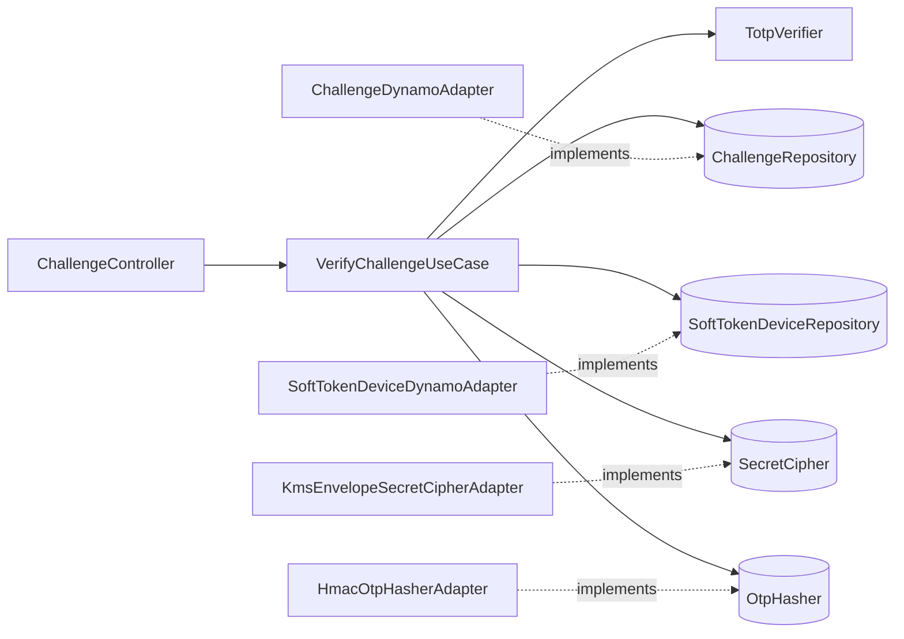
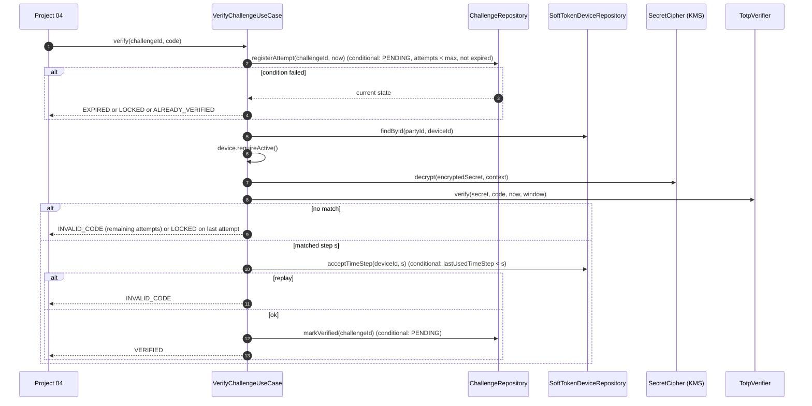
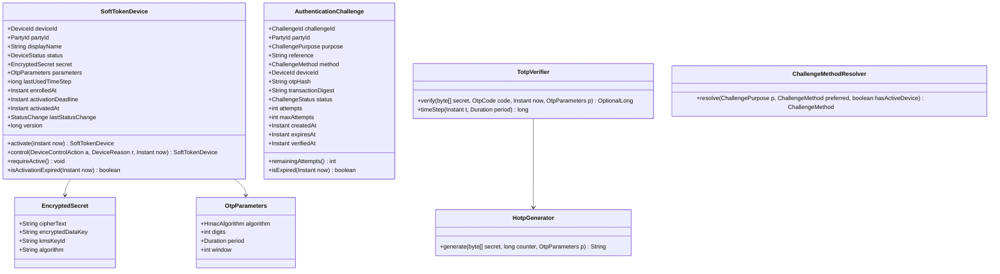
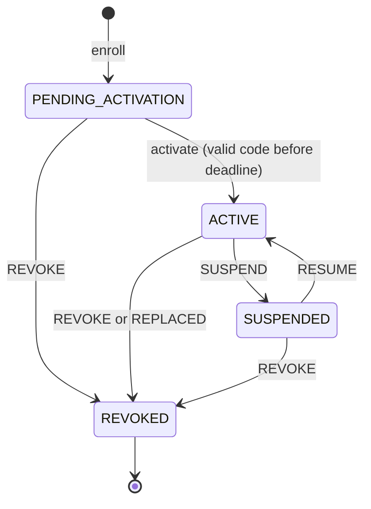
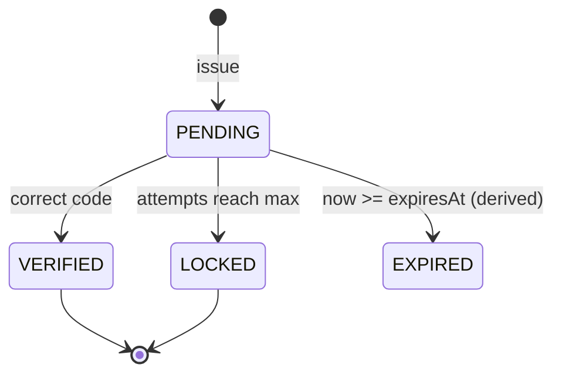

# Second Factor Authentication Service (Soft Token and OTP)

> **Level:** Mid (2 of 4) · **BIAN Service Domain:** Issued Device Administration · **Repository:** `second-factor-authentication` · **Base package:** `co.com.dmillan.sfa`
> **Stack:** Java 25 · Spring WebFlux (annotated controllers) · Amazon DynamoDB (single-table, TTL, conditional writes) · AWS KMS (envelope encryption) · Amazon SQS · JDK crypto (HOTP/TOTP) · Reactive Commons

---

## 1. Project Overview

| Attribute | Value |
|---|---|
| Technical name | `second-factor-authentication` |
| BIAN Service Domain | Issued Device Administration |
| Collaborating BIAN Service Domain | Party Authentication (project 04 consumes this service) |
| BIAN control record (as modelled here) | Issued Device Administration Plan (soft-token device) |
| BIAN behavior qualifiers used (as modelled here) | Device Assignment, Device Authentication Challenge |
| BIAN action terms used | Initiate (enrollment), Execute (activation, verification), Control (suspend/resume/revoke), Request (challenge), Retrieve |
| Difficulty | Mid |
| Stores | DynamoDB |
| Depends on | Project 02 (contact points), project 04 JWKS (user tokens) |
| Suggested timebox | 3 weeks part-time |

**Why this BIAN mapping.** A soft token is an authentication device the bank *issues* to a party and administers through its lifecycle (issue, activate, suspend, revoke). That is Issued Device Administration. The act of verifying the party during login belongs to Party Authentication, which *uses* this service. Being able to explain that split is part of the exercise.

**Elevator pitch.** This service issues and administers time-based soft tokens (RFC 6238 TOTP) and SMS one-time passwords, and verifies second-factor challenges for login (project 04) and high-risk transactions (project 09). Token secrets are protected with KMS envelope encryption; replay, brute force, and challenge flooding are stopped with DynamoDB conditional writes.

**What you will build**

- Soft-token enrollment with a one-time provisioning URI (`otpauth://`).
- Activation by proving possession (first valid TOTP code).
- Device lifecycle control (suspend, resume, revoke).
- Challenge issuance (TOTP or SMS OTP) with rate limiting.
- Challenge verification with attempt limits, expiry, and replay protection.
- Your own HOTP (RFC 4226) and TOTP (RFC 6238) implementation, validated with the RFC test vectors.

**Out of scope**

- Push-notification approval, FIDO2/WebAuthn (a strong stretch topic to mention), the SMS gateway itself (a notification service consumes the SQS queue).

---

## 2. Business Context and Functional Scope

### 2.1 Business problem

Passwords alone are insufficient against phishing and credential stuffing. Regulators and card schemes expect strong customer authentication for sensitive operations. The bank needs a second factor it controls, with a lifecycle that security operations can act on quickly (suspend a device during a fraud investigation).

### 2.2 Actors

| Actor | Token type | Scope / claim |
|---|---|---|
| Customer (through app BFF) | End-user JWT from project 04 | `sfa:device:manage`; `sub` = partyId |
| Project 04, project 09 | Service token | `sfa:challenge` |
| Security operations tooling, project 08 | Service token | `sfa:device:control` |

### 2.3 Functional requirements

| Id | Requirement |
|---|---|
| FR-01 | Enroll a soft token for the authenticated party (`sub`): generate a 160-bit secret, encrypt it, store the device as `PENDING_ACTIVATION`, return the provisioning URI **once**. |
| FR-02 | If the party already has an `ACTIVE` device, enrollment requires `acr = LOA2`. |
| FR-03 | Activate with the first TOTP code within 10 minutes of enrollment. If the party has no other active device, activation also requires a **verified SMS challenge** created for purpose `DEVICE_ACTIVATION` (proves control of the registered mobile). |
| FR-04 | Activation of a new device revokes the previous `ACTIVE` device (one active soft token per party). |
| FR-05 | List the party's devices (self) or any party's devices (service scope). Never return secrets. |
| FR-06 | Control a device: `SUSPEND`, `RESUME`, `REVOKE` with reason. `REVOKE` is terminal. |
| FR-07 | Issue a challenge: `partyId`, `purpose` (`LOGIN`, `TRANSACTION`, `DEVICE_ACTIVATION`), `reference` (authentication id or authorization id), `preferredMethod`. Method resolution: `TOTP` if an active device exists and purpose ≠ `DEVICE_ACTIVATION`; otherwise `SMS_OTP`. |
| FR-08 | For `SMS_OTP`: generate a 6-digit code, store only its HMAC, publish a delivery request to SQS with the mobile number from project 02. |
| FR-09 | Verify a challenge with a 6-digit code. Results: `VERIFIED`, `INVALID_CODE` (attempts remaining), `EXPIRED`, `LOCKED`. |
| FR-10 | Retrieve a challenge status (for project 09 and project 04 polling). |
| FR-11 | Publish events: `SoftTokenEnrolled`, `SoftTokenActivated`, `SoftTokenStatusChanged`, `ChallengeIssued`, `ChallengeVerified`, `ChallengeLocked`. |

### 2.4 Business rules

| Id | Rule |
|---|---|
| BR-01 | TOTP parameters: HMAC-SHA1, 6 digits, 30-second period, verification window ±1 step. |
| BR-02 | A time step, once accepted for a device, can never be accepted again (replay protection via `lastUsedTimeStep`). |
| BR-03 | Challenge TTL: 5 minutes (TOTP), 3 minutes (SMS). Max 3 verification attempts. |
| BR-04 | Rate limits: max 5 challenges per party per 10 minutes; max 3 SMS challenges per party per hour. |
| BR-05 | A challenge can be verified only once; `VERIFIED` is terminal. |
| BR-06 | Device transitions: `PENDING_ACTIVATION → ACTIVE`, `ACTIVE ⇄ SUSPENDED`, any non-terminal → `REVOKED`, `PENDING_ACTIVATION → EXPIRED` (derived after 10 minutes). |
| BR-07 | `TOTP` challenges require the device to be `ACTIVE` at verification time (a device suspended after the challenge was issued makes verification fail with `LOCKED`). |
| BR-08 | For `TRANSACTION` purpose, the challenge stores a `transactionDigest` (SHA-256 of amount + destination) supplied by project 09 so the verification is bound to that transaction. |

### 2.5 BIAN mapping

| Capability | BIAN action term | Endpoint |
|---|---|---|
| Enroll soft token | Initiate | `POST /api/v1/issued-device-administration/soft-tokens` |
| Activate | Execute | `POST /api/v1/issued-device-administration/soft-tokens/{deviceId}/activation` |
| List own devices | Retrieve | `GET /api/v1/issued-device-administration/soft-tokens` |
| List party devices | Retrieve | `GET /api/v1/issued-device-administration/parties/{partyId}/soft-tokens` |
| Control device | Control | `POST /api/v1/issued-device-administration/soft-tokens/{deviceId}/control` |
| Issue challenge | Request | `POST /api/v1/issued-device-administration/challenges` |
| Verify challenge | Execute | `POST /api/v1/issued-device-administration/challenges/{challengeId}/verification` |
| Retrieve challenge | Retrieve | `GET /api/v1/issued-device-administration/challenges/{challengeId}` |

---

## 3. Architecture and Learning Objectives

### 3.1 Learning objectives

1. Implement HOTP/TOTP from the RFCs in pure Java and prove correctness with official test vectors.
2. Design a DynamoDB single-table model with access patterns first.
3. Use conditional writes as concurrency and security controls (attempt counters, replay protection, rate limits).
4. Implement KMS envelope encryption with encryption context.
5. Publish to SQS from a reactive pipeline using the AWS SDK v2 async client.
6. Enforce assurance-level (`acr`) requirements from JWT claims in the entry point and pass them to use cases as domain data.

### 3.2 Layer map

| Layer | Module | Responsibilities |
|---|---|---|
| Domain | `domain/model` | `SoftTokenDevice`, `AuthenticationChallenge`, `HotpGenerator`, `TotpVerifier`, `Base32`, `ProvisioningUriBuilder`, `ChallengeMethodResolver`, gateways |
| Domain (application logic) | `domain/usecase` | Enroll, activate, list, control, issue challenge, verify challenge, retrieve challenge |
| Application | `applications/app-service` | Wiring, AWS client beans, properties |
| Entry Points | `entry-points/reactive-web` | `SoftTokenController`, `ChallengeController`, `AuthenticatedParty` resolver |
| Driven Adapters | `dynamo-db` | `SoftTokenDeviceDynamoAdapter`, `ChallengeDynamoAdapter`, `RateLimitDynamoAdapter` |
| Driven Adapters | `kms` | `KmsEnvelopeSecretCipherAdapter` |
| Driven Adapters | `sqs-sender` | `OtpDeliverySqsAdapter` |
| Driven Adapters | `rest-consumer` | `PartyContactRestAdapter` (project 02) |
| Driven Adapters | `async-event-bus` | `DeviceEventPublisherAdapter` |
| Driven Adapters | `security-random` (generic) | `SecureRandomAdapter`, `HmacOtpHasherAdapter` |

### 3.3 Dependency direction



`TotpVerifier` receives the **decrypted secret bytes** from the use case and does pure computation (HMAC via `javax.crypto.Mac`, which is JDK). Key custody (KMS) stays in the adapter. The HMAC used to *hash stored SMS OTPs* is behind a port because it depends on a managed secret key.

### 3.4 Scaffold commands

```shell
gradle ca --package=co.com.dmillan.sfa --type=reactive --name=second-factor-authentication --lombok=true --metrics=true --mutation=true
gradle gm  --name=SoftTokenDevice
gradle gm  --name=AuthenticationChallenge
gradle guc --name=EnrollSoftToken
gradle guc --name=ActivateSoftToken
gradle guc --name=ListSoftTokens
gradle guc --name=ControlSoftToken
gradle guc --name=IssueChallenge
gradle guc --name=VerifyChallenge
gradle guc --name=RetrieveChallenge
gradle gda --type=dynamodb
gradle gda --type=kms
gradle gda --type=sqs
gradle gda --type=restconsumer --url=http://localhost:8082
gradle gda --type=asynceventbus
gradle gda --type=generic --name=security-random
gradle gep --type=webflux --router=false
gradle validateStructure
```

### 3.5 Verify TOTP challenge flow



Note the order: the attempt is counted **before** the code is checked. Counting after the check lets an attacker run parallel guesses that all read `attempts = 0`.

### 3.6 Design decisions

| Decision | Choice | Why |
|---|---|---|
| Store | DynamoDB single table | Key-value access, TTL, conditional writes, predictable latency |
| Secret protection | KMS `GenerateDataKey` + local AES-GCM (envelope), encryption context `{partyId, deviceId}` | Private data key per device; context binds ciphertext to its owner; KMS audit in CloudTrail |
| SMS OTP storage | HMAC-SHA256(key, challengeId ‖ otp) | 6-digit space is tiny; a plain hash is trivially brute-forced |
| Rate limiting | Fixed-window counter items with conditional `ADD` | No extra infrastructure; atomic |
| TTL reliance | DynamoDB TTL for cleanup only; expiry always checked in code | TTL deletion is asynchronous and can lag |
| Controller style | Annotated | Access to `@AuthenticationPrincipal Jwt` is convenient for `acr` checks |

---

## 4. Detailed Domain Model

### 4.1 Class diagram



### 4.2 Types

| Type | Kind | Notes |
|---|---|---|
| `DeviceId`, `ChallengeId`, `PartyId` | VO | UUID |
| `DeviceStatus` | Enum | `PENDING_ACTIVATION`, `ACTIVE`, `SUSPENDED`, `REVOKED` |
| `DeviceControlAction` | Enum | `SUSPEND`, `RESUME`, `REVOKE` |
| `DeviceReason` | Enum | `CUSTOMER_REQUEST`, `DEVICE_LOST`, `FRAUD_SUSPECTED`, `REPLACED`, `ADMIN` |
| `StatusChange` | VO | `from`, `to`, `reason`, `changedBy`, `at` |
| `HmacAlgorithm` | Enum | `SHA1("HmacSHA1")`, `SHA256("HmacSHA256")` |
| `OtpParameters` | VO | Defaults per BR-01 |
| `OtpCode` | VO | Exactly `digits` numeric chars; `toString()` = `"******"` |
| `SecretBytes` | VO | Wraps `byte[]`; `destroy()` zeroes; never logged |
| `ProvisioningUri` | VO | `String value`; built by `ProvisioningUriBuilder` |
| `ChallengePurpose` | Enum | `LOGIN`, `TRANSACTION`, `DEVICE_ACTIVATION` |
| `ChallengeMethod` | Enum | `TOTP`, `SMS_OTP` |
| `ChallengeStatus` | Enum | `PENDING`, `VERIFIED`, `LOCKED`, `EXPIRED` (EXPIRED is derived on read when `now >= expiresAt`) |
| `VerificationOutcome` | Sealed interface | `Verified`, `InvalidCode(int remaining)`, `Expired`, `Locked`, `AlreadyVerified` |
| `AuthenticatedParty` | VO | `PartyId partyId`, `AssuranceLevel acr`, `String clientId` — built by the entry point from the JWT |
| `EnrollmentResult` | VO | `SoftTokenDevice device`, `ProvisioningUri uri` |
| `ContactPoint` | VO | `String mobileE164` |
| `OtpDeliveryRequest` | VO | `challengeId`, `mobileE164`, `otp`, `purpose`, `expiresAt`, `templateId` |

### 4.3 Device state machine



### 4.4 Challenge state machine



### 4.5 Algorithms you must implement (from the RFCs, not from a library)

- **HOTP (RFC 4226 §5.3):** HMAC over the 8-byte big-endian counter → dynamic truncation (offset = low 4 bits of last byte; take 31 bits from 4 bytes) → `mod 10^digits` → left-pad with zeros.
- **TOTP (RFC 6238 §4):** counter = `floor((unixSeconds − T0) / period)`, `T0 = 0`.
- **Verification window:** check steps `s−w … s+w`; return the matched step (the use case needs it for replay protection).
- **Constant-time comparison:** `MessageDigest.isEqual` on the byte arrays of the two codes.
- **Base32 (RFC 4648 §6):** encoding only, no padding in the provisioning URI.
- **Provisioning URI:** `otpauth://totp/{issuer}:{accountLabel}?secret={base32}&issuer={issuer}&algorithm=SHA1&digits=6&period=30` with URL-encoded label. Use a non-identifying label (e.g., masked username or device display name), never the document number.

---

## 5. Detailed Class and Package Specification

### 5.1 Package tree

```text
second-factor-authentication/
├── applications/app-service/src/main/java/co/com/dmillan/sfa/
│   ├── MainApplication.java
│   └── config/{UseCasesConfig, DomainServicesConfig, ClockConfig, SfaProperties}.java
├── domain/model/src/main/java/co/com/dmillan/sfa/model/
│   ├── device/{SoftTokenDevice, DeviceId, DeviceStatus, DeviceControlAction, DeviceReason, StatusChange, EncryptedSecret, EnrollmentResult}.java
│   ├── device/gateways/{SoftTokenDeviceRepository, SecretCipher, SecretGenerator}.java
│   ├── otp/{OtpParameters, OtpCode, SecretBytes, HmacAlgorithm, ProvisioningUri}.java
│   ├── otp/service/{HotpGenerator, TotpVerifier, Base32, ProvisioningUriBuilder, NumericOtpGenerator}.java
│   ├── challenge/{AuthenticationChallenge, ChallengeId, ChallengePurpose, ChallengeMethod, ChallengeStatus, VerificationOutcome, IssueChallengeCommand}.java
│   ├── challenge/service/ChallengeMethodResolver.java
│   ├── challenge/gateways/{ChallengeRepository, OtpHasher, OtpDeliveryGateway, ChallengeRateLimiter}.java
│   ├── party/{PartyId, AuthenticatedParty, AssuranceLevel, ContactPoint}.java
│   ├── party/gateways/PartyContactGateway.java
│   ├── event/{DeviceEvent, SoftTokenEnrolled, SoftTokenActivated, SoftTokenStatusChanged, ChallengeIssued, ChallengeVerified, ChallengeLocked}.java
│   ├── event/gateways/DeviceEventPublisher.java
│   └── commons/gateways/IdGenerator.java, commons/exception/*.java
├── domain/usecase/src/main/java/co/com/dmillan/sfa/usecase/
│   ├── enrollsofttoken/EnrollSoftTokenUseCase.java
│   ├── activatesofttoken/ActivateSoftTokenUseCase.java
│   ├── listsofttokens/ListSoftTokensUseCase.java
│   ├── controlsofttoken/ControlSoftTokenUseCase.java
│   ├── issuechallenge/IssueChallengeUseCase.java
│   ├── verifychallenge/VerifyChallengeUseCase.java
│   └── retrievechallenge/RetrieveChallengeUseCase.java
├── infrastructure/entry-points/reactive-web/.../api/
│   ├── SoftTokenController.java
│   ├── ChallengeController.java
│   ├── support/{AuthenticatedPartyResolver, AssuranceGuard}.java
│   ├── dto/{EnrollSoftTokenRequest, EnrollSoftTokenResponse, ActivateSoftTokenRequest, SoftTokenResponse, ControlSoftTokenRequest, IssueChallengeRequest, ChallengeResponse, VerifyChallengeRequest, VerificationResponse}.java
│   ├── config/SecurityConfig.java
│   └── error/{GlobalErrorHandler, ErrorHttpStatusMapper}.java
├── infrastructure/driven-adapters/dynamo-db/.../dynamodb/
│   ├── table/{SfaTableItem, DeviceItem, ChallengeItem, RateLimitItem, TableKeys}.java
│   ├── {SoftTokenDeviceDynamoAdapter, ChallengeDynamoAdapter, RateLimitDynamoAdapter}.java
│   ├── mapper/{DeviceItemMapper, ChallengeItemMapper}.java
│   └── config/DynamoDbConfig.java
├── infrastructure/driven-adapters/kms/.../kms/{KmsEnvelopeSecretCipherAdapter, AesGcm, KmsProperties}.java
├── infrastructure/driven-adapters/sqs-sender/.../sqs/{OtpDeliverySqsAdapter, OtpDeliveryMessage, SqsProperties}.java
├── infrastructure/driven-adapters/rest-consumer/.../consumer/{PartyContactRestAdapter, dto/*, config/*}.java
├── infrastructure/driven-adapters/async-event-bus/.../events/DeviceEventPublisherAdapter.java
└── infrastructure/driven-adapters/security-random/.../random/{SecureRandomAdapter, HmacOtpHasherAdapter, OtpHmacProperties}.java
```

### 5.2 Domain — signatures

```java
public final class HotpGenerator {
  public String generate(SecretBytes secret, long counter, OtpParameters parameters);
}

public final class TotpVerifier {
  public TotpVerifier(HotpGenerator hotp);
  public long timeStep(Instant instant, Duration period);
  public OptionalLong verify(SecretBytes secret, OtpCode code, Instant now, OtpParameters parameters);
}

public final class Base32 { public static String encode(byte[] data); }

public final class ProvisioningUriBuilder {
  public ProvisioningUriBuilder(String issuer);
  public ProvisioningUri build(String accountLabel, SecretBytes secret, OtpParameters parameters);
}

public final class NumericOtpGenerator {
  public NumericOtpGenerator(SecretGenerator randomSource);
  public OtpCode next(int digits);          // uniform: rejection sampling, no modulo bias
}

public final class ChallengeMethodResolver {
  public ChallengeMethod resolve(ChallengePurpose purpose, ChallengeMethod preferred, boolean hasActiveDevice);
}

@Builder(toBuilder = true)
public record SoftTokenDevice(...) {
  public static SoftTokenDevice enroll(DeviceId id, PartyId partyId, String displayName,
                                       EncryptedSecret secret, OtpParameters params, Instant now, Duration activationWindow);
  public SoftTokenDevice activate(Instant now);                                   // SFA-4222 when deadline passed
  public SoftTokenDevice control(DeviceControlAction action, DeviceReason reason, String by, Instant now);
  public void requireActive();                                                   // SFA-4231
  public boolean isActivationExpired(Instant now);
  public DeviceStatus effectiveStatus(Instant now);                              // PENDING past deadline → treat as expired
}

@Builder(toBuilder = true)
public record AuthenticationChallenge(...) {
  public static AuthenticationChallenge issue(ChallengeId id, IssueChallengeCommand cmd, ChallengeMethod method,
                                              DeviceId deviceId, String otpHash, Instant now, Duration ttl, int maxAttempts);
  public ChallengeStatus effectiveStatus(Instant now);
  public int remainingAttempts();
}
```

### 5.3 Gateways — signatures

```java
public interface SoftTokenDeviceRepository {
  Mono<SoftTokenDevice> create(SoftTokenDevice device);
  Mono<SoftTokenDevice> findById(PartyId partyId, DeviceId deviceId);
  Flux<SoftTokenDevice> findByParty(PartyId partyId);
  Mono<SoftTokenDevice> findActiveByParty(PartyId partyId);
  Mono<SoftTokenDevice> update(SoftTokenDevice device);                          // condition: version matches
  Mono<Void> activateReplacing(SoftTokenDevice newDevice, SoftTokenDevice previousActive); // TransactWriteItems
  Mono<Boolean> acceptTimeStep(PartyId partyId, DeviceId deviceId, long timeStep); // condition: lastUsedTimeStep < :step
}

public interface SecretCipher {
  Mono<EncryptedSecret> encrypt(SecretBytes secret, Map<String, String> encryptionContext);
  Mono<SecretBytes> decrypt(EncryptedSecret secret, Map<String, String> encryptionContext);
}

public interface SecretGenerator {
  SecretBytes randomSecret(int lengthBytes);
  int randomInt(int boundExclusive);
}

public interface ChallengeRepository {
  Mono<AuthenticationChallenge> create(AuthenticationChallenge challenge);
  Mono<AuthenticationChallenge> findById(ChallengeId id);
  Mono<AuthenticationChallenge> registerAttempt(ChallengeId id, Instant now);    // ADD attempts; condition PENDING, attempts < max, expiresAt > now
                                                                                // on condition failure: emits ChallengeNotAttemptableException(current)
  Mono<Boolean> markVerified(ChallengeId id, Instant now);                       // condition PENDING
  Mono<Void> markLocked(ChallengeId id, Instant now);
}

public interface ChallengeRateLimiter {
  Mono<Void> acquire(PartyId partyId, ChallengeMethod method, Instant now);      // SFA-4291 when exceeded
}

public interface OtpHasher {
  String hash(ChallengeId challengeId, OtpCode code);
  boolean matches(ChallengeId challengeId, OtpCode code, String storedHash);     // constant time
}

public interface OtpDeliveryGateway { Mono<Void> requestDelivery(OtpDeliveryRequest request); }
public interface PartyContactGateway { Mono<ContactPoint> mobileOf(PartyId partyId); }
public interface DeviceEventPublisher { Mono<Void> publish(DeviceEvent event); }
```

### 5.4 Use cases — signatures and steps

```java
public class EnrollSoftTokenUseCase {
  public Mono<EnrollmentResult> enroll(AuthenticatedParty party, String displayName);
}
```
Steps: find active device → if present and `party.acr() != LOA2` → `SFA-4032` → generate 20-byte secret → build provisioning URI → encrypt (context `partyId`, `deviceId`) → `SoftTokenDevice.enroll` → create → destroy secret bytes (`doFinally`) → publish `SoftTokenEnrolled` (non-blocking for the response) → return.

```java
public class ActivateSoftTokenUseCase {
  public Mono<SoftTokenDevice> activate(AuthenticatedParty party, DeviceId deviceId, OtpCode code, ChallengeId smsChallengeId);
}
```
Steps: load device (must belong to `party`) → `PENDING_ACTIVATION` and not expired → if no other active device: `smsChallengeId` required, challenge must be `VERIFIED`, purpose `DEVICE_ACTIVATION`, same party, verified < 10 min ago → decrypt → `TotpVerifier.verify` → `acceptTimeStep` → `activate` → `activateReplacing(new, previousActive)` → publish events.

```java
public class ListSoftTokensUseCase {
  public Flux<SoftTokenDevice> list(PartyId partyId);
}

public class ControlSoftTokenUseCase {
  public Mono<SoftTokenDevice> control(DeviceId deviceId, PartyId partyId, DeviceControlAction action,
                                       DeviceReason reason, String requestedBy, boolean selfService);
  // self-service may SUSPEND or REVOKE its own device, never RESUME (RESUME requires device:control scope)
}

public class IssueChallengeUseCase {
  public Mono<AuthenticationChallenge> issue(IssueChallengeCommand command);
}
```
Steps: find active device → resolve method → `rateLimiter.acquire` → if `SMS_OTP`: fetch mobile (project 02), generate code, hash, create challenge, request delivery (if delivery fails → mark challenge `LOCKED` and return `SFA-5003`) → if `TOTP`: create challenge with `deviceId` → publish `ChallengeIssued`.

```java
public class VerifyChallengeUseCase {
  public Mono<VerificationOutcome> verify(ChallengeId challengeId, OtpCode code, String transactionDigest);
  // follows 3.5; for TRANSACTION purpose, transactionDigest must equal the stored one (else SFA-4003)
  // on INVALID_CODE with remaining == 0 → markLocked + ChallengeLocked event
}

public class RetrieveChallengeUseCase {
  public Mono<AuthenticationChallenge> retrieve(ChallengeId challengeId);
}
```

### 5.5 Entry point — signatures

```java
@RestController
@RequestMapping("/api/v1/issued-device-administration")
@RequiredArgsConstructor
public class SoftTokenController {

  @PostMapping("/soft-tokens")
  @PreAuthorize("hasAuthority('SCOPE_sfa:device:manage')")
  public Mono<ResponseEntity<ApiResponse<EnrollSoftTokenResponse>>> enroll(
      @AuthenticationPrincipal Jwt jwt, @RequestHeader("X-Message-Id") String messageId,
      @Valid @RequestBody EnrollSoftTokenRequest request);

  @PostMapping("/soft-tokens/{deviceId}/activation")
  @PreAuthorize("hasAuthority('SCOPE_sfa:device:manage')")
  public Mono<ResponseEntity<ApiResponse<SoftTokenResponse>>> activate(
      @AuthenticationPrincipal Jwt jwt, @RequestHeader("X-Message-Id") String messageId,
      @PathVariable UUID deviceId, @Valid @RequestBody ActivateSoftTokenRequest request);

  @GetMapping("/soft-tokens")
  @PreAuthorize("hasAuthority('SCOPE_sfa:device:manage')")
  public Mono<ResponseEntity<ApiResponse<List<SoftTokenResponse>>>> listOwn(@AuthenticationPrincipal Jwt jwt,
      @RequestHeader("X-Message-Id") String messageId);

  @GetMapping("/parties/{partyId}/soft-tokens")
  @PreAuthorize("hasAuthority('SCOPE_sfa:device:control')")
  public Mono<ResponseEntity<ApiResponse<List<SoftTokenResponse>>>> listForParty(@PathVariable UUID partyId,
      @RequestHeader("X-Message-Id") String messageId);

  @PostMapping("/soft-tokens/{deviceId}/control")
  @PreAuthorize("hasAnyAuthority('SCOPE_sfa:device:manage','SCOPE_sfa:device:control')")
  public Mono<ResponseEntity<ApiResponse<SoftTokenResponse>>> control(@AuthenticationPrincipal Jwt jwt,
      @RequestHeader("X-Message-Id") String messageId, @PathVariable UUID deviceId,
      @Valid @RequestBody ControlSoftTokenRequest request);
}

@RestController
@RequestMapping("/api/v1/issued-device-administration/challenges")
@PreAuthorize("hasAuthority('SCOPE_sfa:challenge')")
public class ChallengeController {
  @PostMapping public Mono<ResponseEntity<ApiResponse<ChallengeResponse>>> issue(/* headers, @Valid IssueChallengeRequest */);
  @PostMapping("/{challengeId}/verification") public Mono<ResponseEntity<ApiResponse<VerificationResponse>>> verify(/* headers, id, @Valid VerifyChallengeRequest */);
  @GetMapping("/{challengeId}") public Mono<ResponseEntity<ApiResponse<ChallengeResponse>>> retrieve(/* headers, id */);
}

@Component
public class AuthenticatedPartyResolver {
  public AuthenticatedParty from(Jwt jwt);        // sub → PartyId; acr → AssuranceLevel (unknown → LOA1); client_id
}
```

A service token for `control` has no party `sub`; decide how the controller distinguishes self-service (user token) from back-office (service token). Suggested: presence of `SCOPE_sfa:device:control` → back-office path with `partyId` loaded from the device; otherwise self-service requiring `sub` = device owner.

DTOs:

```java
public record EnrollSoftTokenRequest(@NotBlank @Size(max = 40) @Pattern(regexp = "^[\\p{L}0-9 ._-]+$") String displayName) {}
public record EnrollSoftTokenResponse(String deviceId, String status, String provisioningUri, Instant activationDeadline) {}
public record ActivateSoftTokenRequest(@NotBlank @Pattern(regexp = "^\\d{6}$") String otp, UUID smsChallengeId) {}
public record SoftTokenResponse(String deviceId, String displayName, String status, Instant enrolledAt,
                                Instant activatedAt, String lastStatusReason) {}
public record ControlSoftTokenRequest(@NotNull DeviceControlAction action, @NotNull DeviceReason reason) {}
public record IssueChallengeRequest(@NotNull UUID partyId, @NotNull ChallengePurpose purpose,
                                    @NotBlank @Size(max = 64) String reference,
                                    ChallengeMethod preferredMethod,
                                    @Pattern(regexp = "^[a-f0-9]{64}$") String transactionDigest) {}
public record ChallengeResponse(String challengeId, String partyId, String purpose, String method, String status,
                                int remainingAttempts, Instant expiresAt, Instant verifiedAt, String maskedDestination) {}
public record VerifyChallengeRequest(@NotBlank @Pattern(regexp = "^\\d{6}$") String otp,
                                     @Pattern(regexp = "^[a-f0-9]{64}$") String transactionDigest) {}
public record VerificationResponse(String challengeId, String result, int remainingAttempts) {}
```

Verification always returns **200** with `result` (`VERIFIED`, `INVALID_CODE`, `EXPIRED`, `LOCKED`, `ALREADY_VERIFIED`) because the caller (project 04/09) needs to branch on it; HTTP errors are reserved for malformed requests and unknown challenges. Compare this with project 03's DENY decision.

### 5.6 Driven adapters — signatures and details

```java
@DynamoDbBean
public class SfaTableItem {                   // Enhanced Client bean; one class per item type is also fine
  // pk, sk, gsi1pk, gsi1sk, itemType, ttl (Number, epoch seconds), version (@DynamoDbVersionAttribute), + attributes
}

@Component
public class SoftTokenDeviceDynamoAdapter implements SoftTokenDeviceRepository {
  public SoftTokenDeviceDynamoAdapter(DynamoDbEnhancedAsyncClient enhanced, DynamoDbAsyncClient low, SfaProperties props);
  // acceptTimeStep → low-level UpdateItem:
  //   UpdateExpression "SET lastUsedTimeStep = :s", ConditionExpression "attribute_not_exists(lastUsedTimeStep) OR lastUsedTimeStep < :s"
  //   ConditionalCheckFailedException → false
  // activateReplacing → TransactWriteItems (update new device + update previous device with version conditions)
}

@Component
public class ChallengeDynamoAdapter implements ChallengeRepository {
  // registerAttempt → UpdateItem "ADD attempts :one", condition "#st = :pending AND attempts < maxAttempts AND expiresAt > :now",
  //   ReturnValues ALL_NEW; on ConditionalCheckFailedException use ReturnValuesOnConditionCheckFailure ALL_OLD to explain why
}

@Component
public class RateLimitDynamoAdapter implements ChallengeRateLimiter {
  // item pk "RATE#{partyId}", sk "{method}#{windowStartEpoch}", ADD count :one, condition "attribute_not_exists(#c) OR #c < :limit", ttl = window end + 1h
}

@Component
public class KmsEnvelopeSecretCipherAdapter implements SecretCipher {
  public KmsEnvelopeSecretCipherAdapter(KmsAsyncClient kms, KmsProperties props);
  // encrypt: GenerateDataKey(AES_256, context) → AES-GCM(plaintextKey, secret) → zero plaintextKey → EncryptedSecret(cipher, CiphertextBlob, keyId)
  // decrypt: Decrypt(CiphertextBlob, same context) → AES-GCM decrypt → zero key
}

@Component
public class OtpDeliverySqsAdapter implements OtpDeliveryGateway {
  public OtpDeliverySqsAdapter(SqsAsyncClient sqs, SqsProperties props, ObjectMapper mapper);
  // SendMessage with MessageAttributes (messageId, purpose); queue uses SSE-KMS; message body = OtpDeliveryMessage JSON
}

public record OtpDeliveryMessage(int schemaVersion, String challengeId, String mobile, String otp,
                                 String templateId, Instant expiresAt) {
  @Override public String toString();                     // redacts mobile and otp
}

@Component
public class HmacOtpHasherAdapter implements OtpHasher { /* HmacSHA256 with key from Secrets Manager */ }

@Component
public class SecureRandomAdapter implements SecretGenerator { /* SecureRandom.getInstanceStrong() is blocking on some OSes — use new SecureRandom() and explain why */ }
```

### 5.7 Unit tests you must write

| Test | Cases |
|---|---|
| `HotpGeneratorTest` | RFC 4226 Appendix D: secret `12345678901234567890`, counters 0–9 → `755224`, `287082`, `359152`, `969429`, `338314`, `254676`, `287922`, `162583`, `399871`, `520489` |
| `TotpVerifierTest` | RFC 6238 Appendix B SHA-1 vectors (8 digits in the RFC — parameterize digits); window boundaries; returned step |
| `Base32Test` | RFC 4648 §10 vectors |
| `NumericOtpGeneratorTest` | Always 6 digits with leading zeros; distribution sanity check |
| `ProvisioningUriBuilderTest` | URL encoding of labels with spaces/accents |
| `SoftTokenDeviceTest` / `AuthenticationChallengeTest` | All transitions, effective status |
| `ChallengeMethodResolverTest` | Purpose × device × preferred matrix |
| `VerifyChallengeUseCaseTest` | Verified, invalid with remaining, lock on last attempt, expired, replayed step, suspended device, digest mismatch |
| `EnrollSoftTokenUseCaseTest` | LOA1 with active device rejected; secret destroyed after use |
| `ActivateSoftTokenUseCaseTest` | First device requires SMS proof; replacement revokes previous |
| `ChallengeDynamoAdapterTest` | DynamoDB Local or LocalStack: 10 parallel `registerAttempt` with max 3 → exactly 3 succeed |
| `KmsEnvelopeSecretCipherAdapterTest` | LocalStack KMS: round trip; wrong context fails |

---

## 6. API and OpenAPI Contract

### 6.1 Endpoints

| Method | Path (prefix `/api/v1/issued-device-administration`) | Token | Success |
|---|---|---|---|
| POST | `/soft-tokens` | User, `sfa:device:manage` (+ LOA2 if an active device exists) | 201 |
| POST | `/soft-tokens/{deviceId}/activation` | User, `sfa:device:manage` | 200 |
| GET | `/soft-tokens` | User, `sfa:device:manage` | 200 |
| GET | `/parties/{partyId}/soft-tokens` | Service, `sfa:device:control` | 200 |
| POST | `/soft-tokens/{deviceId}/control` | User or service | 200 |
| POST | `/challenges` | Service, `sfa:challenge` | 201 |
| POST | `/challenges/{challengeId}/verification` | Service, `sfa:challenge` | 200 |
| GET | `/challenges/{challengeId}` | Service, `sfa:challenge` | 200 |

### 6.2 OpenAPI

```yaml
openapi: 3.0.3
info:
  title: Issued Device Administration - Second Factor Authentication
  version: 1.0.0
security:
  - bearerAuth: []
paths:
  /api/v1/issued-device-administration/soft-tokens:
    post:
      operationId: enrollSoftToken
      summary: Initiate soft-token enrollment (BIAN action term Initiate)
      parameters:
        - $ref: '#/components/parameters/XMessageId'
      requestBody:
        required: true
        content:
          application/json:
            schema:
              type: object
              required: [displayName]
              properties:
                displayName: { type: string, maxLength: 40 }
      responses:
        '201':
          description: Enrollment created; provisioning URI shown once
          headers:
            Cache-Control: { schema: { type: string, example: no-store } }
          content:
            application/json:
              schema:
                type: object
                properties:
                  data:
                    type: object
                    properties:
                      meta: { $ref: '#/components/schemas/Meta' }
                      payload:
                        type: object
                        properties:
                          deviceId: { type: string, format: uuid }
                          status: { type: string, enum: [PENDING_ACTIVATION] }
                          provisioningUri: { type: string, example: 'otpauth://totp/DMillanBank:m***a?secret=JBSWY3DPEHPK3PXP&issuer=DMillanBank&algorithm=SHA1&digits=6&period=30' }
                          activationDeadline: { type: string, format: date-time }
        '403': { $ref: '#/components/responses/Error' }
        '429': { $ref: '#/components/responses/Error' }
    get:
      operationId: listOwnSoftTokens
      parameters:
        - $ref: '#/components/parameters/XMessageId'
      responses:
        '200':
          description: Devices of the authenticated party
          content:
            application/json:
              schema: { $ref: '#/components/schemas/SoftTokenListEnvelope' }
  /api/v1/issued-device-administration/soft-tokens/{deviceId}/activation:
    post:
      operationId: activateSoftToken
      summary: Execute activation (BIAN action term Execute)
      parameters:
        - $ref: '#/components/parameters/XMessageId'
        - $ref: '#/components/parameters/DeviceId'
      requestBody:
        required: true
        content:
          application/json:
            schema:
              type: object
              required: [otp]
              properties:
                otp: { type: string, pattern: '^\d{6}$' }
                smsChallengeId: { type: string, format: uuid }
      responses:
        '200':
          description: Activated
          content:
            application/json:
              schema: { $ref: '#/components/schemas/SoftTokenEnvelope' }
        '401': { $ref: '#/components/responses/Error' }
        '404': { $ref: '#/components/responses/Error' }
        '422': { $ref: '#/components/responses/Error' }
  /api/v1/issued-device-administration/parties/{partyId}/soft-tokens:
    get:
      operationId: listPartySoftTokens
      parameters:
        - $ref: '#/components/parameters/XMessageId'
        - name: partyId
          in: path
          required: true
          schema: { type: string, format: uuid }
      responses:
        '200':
          description: Devices of the party
          content:
            application/json:
              schema: { $ref: '#/components/schemas/SoftTokenListEnvelope' }
  /api/v1/issued-device-administration/soft-tokens/{deviceId}/control:
    post:
      operationId: controlSoftToken
      summary: Suspend, resume or revoke (BIAN action term Control)
      parameters:
        - $ref: '#/components/parameters/XMessageId'
        - $ref: '#/components/parameters/DeviceId'
      requestBody:
        required: true
        content:
          application/json:
            schema:
              type: object
              required: [action, reason]
              properties:
                action: { type: string, enum: [SUSPEND, RESUME, REVOKE] }
                reason: { type: string, enum: [CUSTOMER_REQUEST, DEVICE_LOST, FRAUD_SUSPECTED, REPLACED, ADMIN] }
      responses:
        '200':
          description: Status changed
          content:
            application/json:
              schema: { $ref: '#/components/schemas/SoftTokenEnvelope' }
        '403': { $ref: '#/components/responses/Error' }
        '422': { $ref: '#/components/responses/Error' }
  /api/v1/issued-device-administration/challenges:
    post:
      operationId: issueChallenge
      summary: Request a second-factor challenge (BIAN action term Request)
      parameters:
        - $ref: '#/components/parameters/XMessageId'
        - $ref: '#/components/parameters/XClientId'
      requestBody:
        required: true
        content:
          application/json:
            schema:
              type: object
              required: [partyId, purpose, reference]
              properties:
                partyId: { type: string, format: uuid }
                purpose: { type: string, enum: [LOGIN, TRANSACTION, DEVICE_ACTIVATION] }
                reference: { type: string, maxLength: 64 }
                preferredMethod: { type: string, enum: [TOTP, SMS_OTP] }
                transactionDigest: { type: string, pattern: '^[a-f0-9]{64}$' }
      responses:
        '201':
          description: Challenge issued
          content:
            application/json:
              schema: { $ref: '#/components/schemas/ChallengeEnvelope' }
        '422': { $ref: '#/components/responses/Error' }
        '429': { $ref: '#/components/responses/Error' }
        '503': { $ref: '#/components/responses/Error' }
  /api/v1/issued-device-administration/challenges/{challengeId}/verification:
    post:
      operationId: verifyChallenge
      summary: Execute verification (BIAN action term Execute)
      parameters:
        - $ref: '#/components/parameters/XMessageId'
        - $ref: '#/components/parameters/XClientId'
        - $ref: '#/components/parameters/ChallengeId'
      requestBody:
        required: true
        content:
          application/json:
            schema:
              type: object
              required: [otp]
              properties:
                otp: { type: string, pattern: '^\d{6}$' }
                transactionDigest: { type: string, pattern: '^[a-f0-9]{64}$' }
      responses:
        '200':
          description: Verification outcome
          content:
            application/json:
              schema:
                type: object
                properties:
                  data:
                    type: object
                    properties:
                      meta: { $ref: '#/components/schemas/Meta' }
                      payload:
                        type: object
                        properties:
                          challengeId: { type: string, format: uuid }
                          result: { type: string, enum: [VERIFIED, INVALID_CODE, EXPIRED, LOCKED, ALREADY_VERIFIED] }
                          remainingAttempts: { type: integer }
        '400': { $ref: '#/components/responses/Error' }
        '404': { $ref: '#/components/responses/Error' }
  /api/v1/issued-device-administration/challenges/{challengeId}:
    get:
      operationId: retrieveChallenge
      parameters:
        - $ref: '#/components/parameters/XMessageId'
        - $ref: '#/components/parameters/XClientId'
        - $ref: '#/components/parameters/ChallengeId'
      responses:
        '200':
          description: Challenge
          content:
            application/json:
              schema: { $ref: '#/components/schemas/ChallengeEnvelope' }
        '404': { $ref: '#/components/responses/Error' }
components:
  securitySchemes:
    bearerAuth: { type: http, scheme: bearer, bearerFormat: JWT }
  parameters:
    XMessageId: { name: X-Message-Id, in: header, required: true, schema: { type: string, format: uuid } }
    XClientId: { name: X-Client-Id, in: header, required: true, schema: { type: string } }
    DeviceId: { name: deviceId, in: path, required: true, schema: { type: string, format: uuid } }
    ChallengeId: { name: challengeId, in: path, required: true, schema: { type: string, format: uuid } }
  responses:
    Error:
      description: Error envelope
      content:
        application/json:
          schema: { $ref: '#/components/schemas/ErrorResponse' }
  schemas:
    SoftToken:
      type: object
      properties:
        deviceId: { type: string, format: uuid }
        displayName: { type: string }
        status: { type: string, enum: [PENDING_ACTIVATION, ACTIVE, SUSPENDED, REVOKED] }
        enrolledAt: { type: string, format: date-time }
        activatedAt: { type: string, format: date-time, nullable: true }
        lastStatusReason: { type: string, nullable: true }
    SoftTokenEnvelope:
      type: object
      properties:
        data:
          type: object
          properties:
            meta: { $ref: '#/components/schemas/Meta' }
            payload: { $ref: '#/components/schemas/SoftToken' }
    SoftTokenListEnvelope:
      type: object
      properties:
        data:
          type: object
          properties:
            meta: { $ref: '#/components/schemas/Meta' }
            payload:
              type: array
              items: { $ref: '#/components/schemas/SoftToken' }
    Challenge:
      type: object
      properties:
        challengeId: { type: string, format: uuid }
        partyId: { type: string, format: uuid }
        purpose: { type: string }
        method: { type: string, enum: [TOTP, SMS_OTP] }
        status: { type: string, enum: [PENDING, VERIFIED, LOCKED, EXPIRED] }
        remainingAttempts: { type: integer }
        expiresAt: { type: string, format: date-time }
        verifiedAt: { type: string, format: date-time, nullable: true }
        maskedDestination: { type: string, nullable: true, example: '+57******4567' }
    ChallengeEnvelope:
      type: object
      properties:
        data:
          type: object
          properties:
            meta: { $ref: '#/components/schemas/Meta' }
            payload: { $ref: '#/components/schemas/Challenge' }
    Meta:
      type: object
      properties:
        messageId: { type: string }
        clientId: { type: string }
        timestamp: { type: string, format: date-time }
    ErrorResponse:
      type: object
      properties:
        meta: { $ref: '#/components/schemas/Meta' }
        errors:
          type: array
          items:
            type: object
            properties:
              status: { type: string }
              code: { type: string }
              title: { type: string }
              detail: { type: string }
```

### 6.3 Examples

Issue challenge (from project 09):

```json
{
  "partyId": "7d0c3a8e-51b2-4a55-9c1e-3f7a2b6d9e01",
  "purpose": "TRANSACTION",
  "reference": "auth-9f1c2d3e",
  "preferredMethod": "TOTP",
  "transactionDigest": "9b74c9897bac770ffc029102a200c5de2f1c0e3a7d1b6f5e4c3a2b1d0e9f8a7b"
}
```

Verification outcome:

```json
{
  "data": {
    "meta": { "messageId": "7e2a...", "clientId": "transaction-authorization", "timestamp": "2026-09-17T16:30:10Z" },
    "payload": { "challengeId": "c7f0a1b2-...", "result": "INVALID_CODE", "remainingAttempts": 1 }
  }
}
```

---

## 7. Error Handling and Security

### 7.1 Error catalog

| Code | HTTP | Title |
|---|---|---|
| SFA-4001 | 400 | Invalid request |
| SFA-4003 | 400 | Transaction digest mismatch |
| SFA-4010 | 401 | Unauthorized |
| SFA-4011 | 401 | Invalid activation code |
| SFA-4030 | 403 | Forbidden |
| SFA-4031 | 403 | Device does not belong to the party |
| SFA-4032 | 403 | Higher assurance level required (`WWW-Authenticate` with `insufficient_user_authentication` hint, as in RFC 9470) |
| SFA-4041 | 404 | Device not found |
| SFA-4042 | 404 | Challenge not found |
| SFA-4091 | 409 | Concurrent modification |
| SFA-4221 | 422 | Invalid device status transition |
| SFA-4222 | 422 | Activation window expired |
| SFA-4223 | 422 | Activation proof required (verified SMS challenge) |
| SFA-4224 | 422 | No active device for TOTP |
| SFA-4225 | 422 | No mobile number registered |
| SFA-4231 | 423 | Device not active |
| SFA-4291 | 429 | Too many challenges (`Retry-After`) |
| SFA-5000 | 500 | Unexpected error |
| SFA-5001 | 503 | Device store unavailable |
| SFA-5002 | 503 | Key management unavailable |
| SFA-5003 | 503 | OTP delivery unavailable |
| SFA-5004 | 503 | Party directory unavailable |

### 7.2 Security controls

| Threat | Control |
|---|---|
| Secret theft from DB | Envelope encryption with KMS + encryption context; KMS key policy restricted to IRSA role |
| Secret exposure after enrollment | URI returned once, `Cache-Control: no-store`, never logged, never retrievable |
| Rogue device enrollment (account takeover) | LOA2 required when a device exists; SMS proof for first device; events to project 08 |
| OTP brute force | Attempt counted before check; max 3; 6-digit space; rate limits |
| Parallel guessing | Conditional `ADD` on attempts |
| Code replay | `lastUsedTimeStep` conditional update |
| Challenge flooding / SMS pumping fraud | Per-party and per-method limits; SMS limit per hour; metric on SMS volume |
| Transaction tampering | `transactionDigest` binding (BR-08) — a "what you see is what you sign" lite |
| Timing leaks | Constant-time comparisons |
| SIM swap risk for SMS | Prefer TOTP; project 08 correlates SIM-swap signals (stretch: consume a telco SIM-swap API) |
| PII in SQS | SSE-KMS queue; message `toString()` redacted; short retention (e.g., 5 min) and DLQ with restricted access |

---

## 8. Persistence and Infrastructure

### 8.1 DynamoDB table `sfa-main`

Access patterns first:

| # | Access pattern | Key condition |
|---|---|---|
| AP1 | Get device by party + device id | `PK = PARTY#{partyId}`, `SK = DEVICE#{deviceId}` |
| AP2 | List devices of a party | `PK = PARTY#{partyId}`, `begins_with(SK, "DEVICE#")` |
| AP3 | Find active device of a party | AP2 + filter `status = ACTIVE` (small item collection — acceptable) |
| AP4 | Get challenge by id | `PK = CHALLENGE#{challengeId}`, `SK = META` |
| AP5 | Challenges of a party (support) | GSI1: `GSI1PK = PARTY#{partyId}`, `GSI1SK begins_with CHALLENGE#` |
| AP6 | Rate-limit counter | `PK = RATE#{partyId}`, `SK = {method}#{windowStart}` |
| AP7 | Get device by id only (back-office control) | GSI2: `GSI2PK = DEVICE#{deviceId}` |

Item attributes:

| Item | Attributes |
|---|---|
| Device | `pk`, `sk`, `gsi2pk`, `itemType=DEVICE`, `partyId`, `deviceId`, `displayName`, `status`, `cipherText`, `encryptedDataKey`, `kmsKeyId`, `algorithm`, `digits`, `period`, `window`, `lastUsedTimeStep`, `enrolledAt`, `activationDeadline`, `activatedAt`, `statusFrom`, `statusReason`, `statusChangedBy`, `statusChangedAt`, `version` |
| Challenge | `pk`, `sk`, `gsi1pk`, `gsi1sk = CHALLENGE#{createdAt}`, `itemType=CHALLENGE`, `challengeId`, `partyId`, `purpose`, `reference`, `method`, `deviceId`, `otpHash`, `transactionDigest`, `status`, `attempts`, `maxAttempts`, `createdAt`, `expiresAt`, `verifiedAt`, `ttl` (expiresAt + 24 h) |
| Rate limit | `pk`, `sk`, `itemType=RATE`, `count`, `ttl` |

Capacity: on-demand. Point-in-time recovery enabled. Encryption with a customer-managed KMS key.

### 8.2 Other AWS resources

| Resource | Settings |
|---|---|
| KMS key `sfa-token-secrets` | Symmetric, `ENCRYPT_DECRYPT`; key policy allows `GenerateDataKey`/`Decrypt` for the service role with condition on encryption context keys |
| SQS queue `otp-delivery-requests` | SSE-KMS, retention 300 s, visibility 30 s, DLQ after 3 receives |
| Secrets Manager | OTP HMAC key |
| MSK / RabbitMQ | Device events |

### 8.3 Configuration keys

| Key | Example |
|---|---|
| `sfa.table-name` | `sfa-main` |
| `sfa.otp.digits` / `period` / `window` / `algorithm` | `6` / `30s` / `1` / `SHA1` |
| `sfa.otp.issuer` | `DMillanBank` |
| `sfa.device.activation-window` | `10m` |
| `sfa.challenge.ttl.totp` / `ttl.sms` / `max-attempts` | `5m` / `3m` / `3` |
| `sfa.rate-limit.challenges-per-10m` / `sms-per-hour` | `5` / `3` |
| `sfa.kms.key-id` | alias ARN |
| `sfa.sqs.otp-queue-url` | queue URL |
| `sfa.party-directory.base-url` / `timeout` | … / `800ms` |
| `spring.security.oauth2.resourceserver.jwt.jwk-set-uri` | project 04 JWKS |

Local: LocalStack (DynamoDB, KMS, SQS) with an init script that creates the table, GSIs, key, and queue.

---

## 9. Observability, Privacy, SLA and Production Requirements

### 9.1 Metrics

| Metric | Type | Tags |
|---|---|---|
| `sfa_challenges_issued_total` | Counter | `method`, `purpose` |
| `sfa_verifications_total` | Counter | `method`, `result` |
| `sfa_replay_rejections_total` | Counter | — |
| `sfa_rate_limited_total` | Counter | `method` |
| `sfa_sms_requests_total` | Counter | — (watch for SMS pumping) |
| `sfa_enrollments_total` / `sfa_activations_total` | Counter | `result` |
| `sfa_kms_duration_seconds` | Timer | `operation` |
| `sfa_dynamodb_conditional_failures_total` | Counter | `operation` |

Alerts: `result=LOCKED` ratio spike, SMS volume anomaly, KMS throttling (`ThrottlingException`) count > 0.

### 9.2 SLOs

| SLI | Target |
|---|---|
| Availability | 99.95% |
| Verify p95 | ≤ 120 ms (includes KMS Decrypt) |
| Issue (TOTP) p95 | ≤ 60 ms |
| Issue (SMS) p95 | ≤ 250 ms (includes project 02 + SQS) |

### 9.3 Privacy

Mobile numbers are fetched per SMS challenge and never stored in this service; only `maskedDestination` is kept on the challenge. OTPs exist in clear only in memory and in the encrypted SQS message.

### 9.4 Production readiness

- KMS call budget: every TOTP verification is one `Decrypt`. Estimate monthly cost and KMS request quotas; consider a short-lived in-memory data-key cache (AWS Encryption SDK caching CMM concept) as a stretch, and document the security trade-off.
- Clock: TOTP depends on accurate time; pods rely on node NTP (Amazon Time Sync). Expose a metric of the verification step offset (how often ±1 matches) to detect drift.
- DynamoDB retries: SDK retries with jitter; set a total API call timeout (e.g., 300 ms) so reactive chains fail fast.

---

## 10. CI/CD and Deployment Strategy

Pipeline as project 01 with LocalStack services for adapter tests.

| Item | Setting |
|---|---|
| Infrastructure as code | Terraform or CDK module in `deployment/infra/` for table, key, queue (write it yourself) |
| IRSA policy | `dynamodb:GetItem/PutItem/UpdateItem/Query/TransactWriteItems` on the table and GSIs only; `kms:GenerateDataKey`/`Decrypt` with `kms:EncryptionContextKeys` condition; `sqs:SendMessage` on one queue |
| Replicas | min 3, HPA on CPU 60% |
| PDB | `minAvailable: 2` |
| Rollout | Rolling; feature flag `sfa.sms.enabled` to disable SMS quickly during an SMS-pumping incident |

---

## 11. Interview Preparation and Portfolio Evaluation

### 11.1 Talking points

1. How HOTP dynamic truncation works, and how you proved your implementation.
2. Why the attempt is counted before the code is checked.
3. Envelope encryption and encryption context.
4. Single-table design driven by access patterns; why TTL is not an expiry mechanism.
5. Why Issued Device Administration is the right BIAN domain, and how it collaborates with Party Authentication.
6. Account-takeover path through device enrollment and how you closed it.

### 11.2 Rubric

| Criterion | Weight | Evidence |
|---|---|---|
| Algorithm correctness | 20% | RFC vectors pass; constant-time compare |
| Concurrency and abuse controls | 25% | Conditional writes with parallel tests |
| Key management | 15% | Envelope + context; secrets zeroed |
| Clean Architecture | 15% | AWS SDK only in adapters; algorithms pure |
| API/security design | 15% | LOA2 enforcement, one-time URI, digest binding |
| Operability | 10% | Abuse metrics and alerts |

### 11.3 Definition of Done

- [ ] Scan the provisioning URI with a real authenticator app and activate the device.
- [ ] Demo: reuse the same code twice within 30 s → second is rejected.
- [ ] Demo: 10 parallel wrong codes → exactly 3 attempts recorded, challenge `LOCKED`.
- [ ] ADRs: BIAN mapping, secret protection, SMS risk acceptance.

---

## Mentorship Guidance

### What to practice coding yourself

1. **HOTP from the RFC.** Implement dynamic truncation with bit operations (`& 0x0f`, `& 0x7f`, shifts) and make all ten RFC vectors pass before writing anything else.
2. **Base32 encoder.** Write it with a bit buffer; test with the RFC 4648 vectors.
3. **Uniform random digits.** Implement rejection sampling and explain why `random.nextInt() % 1_000_000` is biased when not done correctly.
4. **Conditional expressions.** Write the three DynamoDB conditional updates with the low-level client and test each failure path using `ReturnValuesOnConditionCheckFailure`.
5. **Envelope encryption.** Implement it with `GenerateDataKey` and AES-GCM; then deliberately change the encryption context in a test and observe the KMS failure.

### Common mistakes to avoid

- Using a TOTP library in the domain without understanding it (you lose the interview story).
- Storing the TOTP secret Base32-encoded "because the app needs it" — store bytes, encrypted.
- Relying on DynamoDB TTL to expire challenges.
- Checking the code first and incrementing attempts afterwards.
- Accepting the same time step twice.
- Comparing codes with `String.equals`.
- Logging the provisioning URI in debug mode.
- Letting SMS delivery failure leave a `PENDING` challenge the user can never complete.
- Allowing `RESUME` from self-service (a thief with the phone could re-enable a device the bank suspended).
- Using `SecureRandom.getInstanceStrong()` on Linux containers without understanding blocking behavior.

### Interview-style questions

1. Walk through HOTP truncation for one example by hand.
2. Why is a ±1 window needed, and what does it cost in brute-force resistance?
3. An attacker has the customer's password and SIM-swapped their phone. Which controls still help?
4. Why not encrypt the secret directly with KMS `Encrypt` instead of envelope encryption? When would direct encryption be fine?
5. Describe the exact DynamoDB condition that prevents replay. What happens if two verifications of the same code race?
6. Why does verification return 200 for `INVALID_CODE`?
7. How would you migrate from SHA-1 TOTP to SHA-256 without breaking existing devices?
8. What is SMS pumping fraud and how would you detect it with your metrics?
9. Why is this service in Issued Device Administration and not Party Authentication? Could someone argue the opposite?
10. How would FIDO2/WebAuthn change the data model and the threat model?
